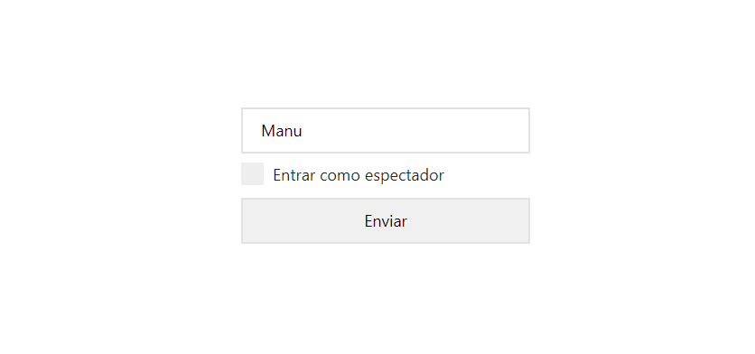
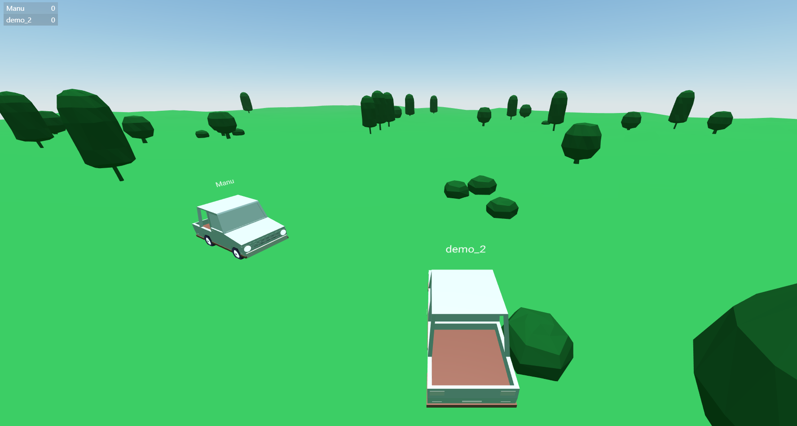
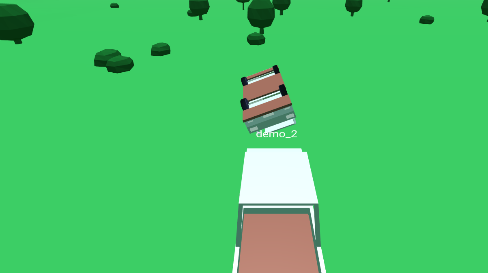

# Aframe Cars

Autos controlables en 3D, a tiempo real con los demás usuarios y pueden chocarse!

Esta demo fue realizada con el fin de ejemplificar el potencial de Aframe, una libreria para JavaScript basada en Three Js que tiene el fin de hacer representaciones 3D de una forma más sencilla y familiar parecido al formato HTML.





Para esta aplicación se utilizó:
* react
* aframe-react
* socket.io

*(y otros más)*

-----------------

### Inicialización

1. **Clonar el repositorio**

   Cloná el repositorio con `git clone https://github.com/manu4gmz/aframe-cars.git` en una carpeta local y accede a ella desde una terminal utilizando `cd aframe-cars`.

2. **Instalar dependencias**

   Entrá a la carpeta de `/back` haciendo `cd back`. Desde allí ejecutá `npm install` y espera a que npm finalice los procesos.

   **Aclaración**: es necesario tener npm instalado en la PC.

3. **Iniciar el servidor**

   En el mismo directorio, ejecutá `node app.js` o `node .` . Si está todo bien deberá verse en la terminal el siguiente mensaje:

   ```
        ----- A-Frame Demo -----
        > Running on port 3000 <
        ------------------------
   ```

   **Aclaración**: es necesario tener Node Js instalado en la PC.

4. **Ingresar**

   Ingresá a `localhost:3000` en tu navegador (preferiblemente Chrome).

5. **Extra**

   Para realizar cambios en front hay que instalar las dependencias de la misma forma que en back, en `/front`, y para mantenerlo    actualizado ejecutar `npm build`.
